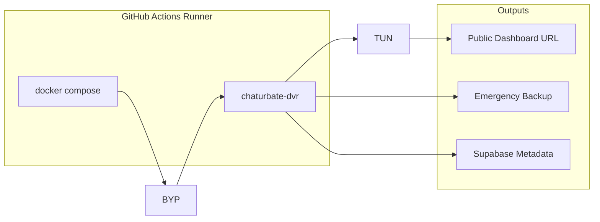
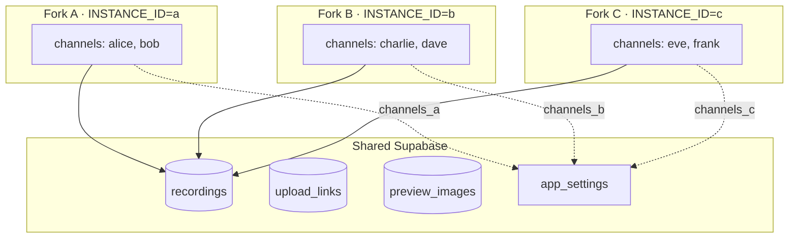

<div align="center">


<br/>

[](https://github.com/vasud3v/chaturbate-recorder/stargazers)
[](https://github.com/vasud3v/chaturbate-recorder/network/members)
[](https://github.com/vasud3v/chaturbate-recorder/issues)
[](https://github.com/vasud3v/chaturbate-recorder/pulls)
[](LICENSE)
[](https://github.com/vasud3v/chaturbate-recorder/commits/main)
[](https://github.com/vasud3v/chaturbate-recorder)
[](https://github.com/vasud3v/chaturbate-recorder/actions/workflows/recorder.yml)

<br/>

<a href="#rocket-quick-start"></a>
<a href="#zap-features"></a>
<a href="#book-deployment-guides"></a>
<a href="#heart-support"></a>

<br/>

**Record live streams automatically** — multi-channel DVR with auto-uploads and a web dashboard. Run it on your server, in Docker, or for free on GitHub Actions.

</div>

---

## :zap: Features

<table>
<tr>
<td width="50%">

### :movie_camera: Recording
- Multi-channel simultaneous capture
- HLS `.ts` + LL-HLS `.m4s` support
- Auto-split by duration or file size
- ffmpeg compression to `.mkv`

</td>
<td width="50%">

### :globe_with_meridians: Deployment
- **Docker Compose** — one command, full stack
- **GitHub Actions** — free 24/7 cloud recording
- **Binary** — single portable executable
- **Web UI** — manage everything from browser

</td>
</tr>
<tr>
<td>

### :cookie: Cookie Auth
- Manual cookie-based authentication
- `sessionid` + `csrftoken` from browser
- Proxy support (SOCKS5/HTTP)

</td>
<td>

### :cloud: Uploads & Storage
- 6+ hosting providers in parallel
- Thumbnail & sprite generation
- Supabase metadata storage
- Browse everything in the dashboard

</td>
</tr>
</table>

---

## :rocket: Quick Start

```bash
git clone https://github.com/vasud3v/chaturbate-recorder.git
cd chaturbate-recorder
cp .env.example .env        # add your API keys (optional)
docker compose up -d --build
```

Open **http://localhost:8080** — add channels, hit record. Done.

---

## :book: Deployment Guides

### :whale: Option A — Docker (Recommended)

**Prerequisites:** [Docker](https://docs.docker.com/get-docker/) + [Docker Compose](https://docs.docker.com/compose/install/)

```bash
# 1. Clone the repo
git clone https://github.com/vasud3v/chaturbate-recorder.git
cd chaturbate-recorder

# 2. Configure environment
cp .env.example .env
# Edit .env with your API keys (see Environment Variables below)

# 3. Start all services
docker compose up -d --build

# 4. View logs
docker compose logs -f chaturbate-dvr
```

**Services started:**

| Service | Port | Purpose |
|---------|------|---------|
| `chaturbate-dvr` | `8080` | Recorder + Web UI |
| `cookie-refresher` | — | Auto cookie renewal |
| `uploader` | — | Background uploads |

**Volumes:** `./videos` · `./conf` · `./database`

---

### :octocat: Option B — GitHub Actions (Free Cloud Recording)

Run the full stack on GitHub-hosted runners — **no server needed**.



**Step-by-step setup:**

1. **Fork** this repository

2. **Add repository secrets** — go to `Settings` → `Secrets and variables` → `Actions` → `New repository secret`

    | Secret | Required | Purpose |
    |--------|----------|---------|
    | `SUPABASE_URL` | Yes | Your Supabase project URL |
    | `SUPABASE_API_KEY` | Yes | Supabase anon/service key |
    | `VOESX_API_KEY` | For uploads | Voe.sx API key |
    | `SENDCM_API_KEY` | For uploads | SendCM API key |
    | `GOFILE_API_KEY` | Optional | GoFile (guest works without) |
    | `BYSE_API_KEY` | Optional | Byse.sx API key |
    | `PROXY_SERVER` | Optional | Proxy URL |
    | `PROXY_USERNAME` | Optional | Proxy auth |
    | `PROXY_PASSWORD` | Optional | Proxy auth |

3. **Configure channels** — edit [`conf/channels.json`](conf/channels.json) in your fork:

   ```json
   [
     {
       "is_paused": false,
       "username": "channel_name",
       "framerate": 30,
       "resolution": 1080,
       "compress": true
     }
   ]
   ```

4. **Set your INSTANCE_ID** — edit `.github/workflows/recorder.yml` and change `INSTANCE_ID: "a"` to a unique value per fork (e.g., `"b"`, `"c"`). This isolates each fork's channels while sharing the same Supabase database.

5. **Run the workflow** — `Actions` tab → `24/7 Recorder` → `Run workflow` → choose duration (1–5 hours)

5. **Get your dashboard URL** — check the run summary

**What happens automatically:**
- Recording runs for the chosen duration with health checks every 60s
- If the recorder crashes, it auto-restarts
- Uploads run in the background to configured hosts
- Emergency backup saved as a GitHub artifact (30-day retention)
- **Next run auto-queues** for continuous 24/7 operation

> **Limits:** GitHub-hosted runners cap at ~5 hours per run. Videos aren't persisted on GitHub long-term — use upload hosts + Supabase for permanent storage.

---

### :repeat: Multi-Instance Setup (Record 100+ Channels)

GitHub Actions has a ~14 GB disk limit (~3–5 channels max per runner). To record more channels, fork this repo to multiple GitHub accounts — all sharing the same Supabase database.



**How it works:**

| Component | Behavior |
|-----------|----------|
| Channels | Isolated per instance via `channels_<instance_id>` in `app_settings` |
| Tunnels | Isolated per instance — each fork gets its own dashboard URL |
| Recordings | Shared — all recordings aggregate into one unified video library |
| Uploads | Shared — all instances upload to the same hosts |
| Cookies | Shared — one instance's cookie refresh benefits all |

**Setup:**

1. **Fork** this repo to each GitHub account
2. **Edit `.github/workflows/recorder.yml`** — set a unique `INSTANCE_ID` per fork:
   ```yaml
   env:
     INSTANCE_ID: "b"  # unique per fork: "a", "b", "c", ...
   ```
3. **Add the same Supabase secrets** to each fork
4. **Run `database/migrate.sql`** in your Supabase SQL Editor (one-time setup)

> **Note:** Don't add the same channel username to multiple instances — both would record it simultaneously and create duplicate uploads.

---

### :desktop_computer: Option C — Local Binary

**Prerequisites:** [Go 1.23+](https://go.dev/dl/), ffmpeg

```bash
# Build from source
go build -o chaturbate-dvr .
./chaturbate-dvr

# Or with options
./chaturbate-dvr --port 8123 --admin-username admin --admin-password secret
```

**CLI mode** (no dashboard, single channel):

```bash
./chaturbate-dvr -u CHANNEL_USERNAME -resolution 1080 -framerate 30
```

---

## :database: Database Setup

Run [`database/migrate.sql`](database/migrate.sql) once in your Supabase SQL Editor. It creates all tables, indexes, RLS policies, and permissions. Safe to re-run — uses `IF NOT EXISTS` everywhere.

```sql
-- Paste the entire contents of database/migrate.sql
```

This sets up:
- `channels`, `recordings`, `upload_links` — core DVR data
- `tunnels`, `tunnel_sessions` — tunnel instance tracking (per-instance)
- `app_settings` — channel configs and cookies (per-instance via `channels_<id>`)
- `channel_logs`, `preview_images`, `disk_usage` — monitoring and metadata

---

## :gear: Environment Variables

| Variable | Required | Description |
|----------|----------|-------------|
| `INSTANCE_ID` | For multi-instance | Unique ID per fork/runner (e.g., `"a"`, `"b"`, `"c"`) |
| `SUPABASE_URL` | For Actions | Supabase project URL |
| `SUPABASE_API_KEY` | For Actions | Supabase anon key |
| `VOESX_API_KEY` | For uploads | Voe.sx API key |
| `SENDCM_API_KEY` | For uploads | SendCM API key |
| `GOFILE_API_KEY` | Optional | GoFile API key |
| `BYSE_API_KEY` | Optional | Byse.sx API key |
| `COOKIES` | Optional | Browser cookies for auth |
| `USER_AGENT` | Optional | Custom User-Agent string |
| `PROXY_SERVER` | Optional | HTTP/SOCKS5 proxy |
| `PROXY_USERNAME` | Optional | Proxy username |
| `PROXY_PASSWORD` | Optional | Proxy password |
| `CHATURBATE_API_INITIAL_RPS` | Optional | Initial stream-discovery API requests per second (default `25`) |
| `CHATURBATE_API_MIN_RPS` | Optional | Minimum adaptive API request rate after failures (default `5`) |
| `CHATURBATE_API_MAX_RPS` | Optional | Maximum adaptive API request rate after successes (default `100`) |
| `CHATURBATE_API_BURST` | Optional | Startup burst capacity for large channel lists (default `250`) |

---

## :camera: Dashboard Preview

<p align="center">
  
</p>

---

## :movie_camera: Upload Hosts

| Host | Environment Variable |
|------|---------------------|
| GoFile | `GOFILE_API_KEY` |
| Voe.sx | `VOESX_API_KEY` |
| SendCM | `SENDCM_API_KEY` |
| Byse | `BYSE_API_KEY` |

Thumbnails use a fallback chain: **Pixhost** → **Catbox** → **Freeimage**.

---

## :bar_chart: Repo Pulse

<p align="center">
  
</p>

---

## :star: Star History

<a href="https://star-history.com/#vasud3v/chaturbate-recorder&Date">
 <picture>
   <source media="(prefers-color-scheme: dark)" srcset="https://api.star-history.com/svg?repos=vasud3v/chaturbate-recorder&type=Date&theme=dark" />
   <source media="(prefers-color-scheme: light)" srcset="https://api.star-history.com/svg?repos=vasud3v/chaturbate-recorder&type=Date" />
   
 </picture>
</a>

---

## :heart: Support

If this project helps you, consider giving it a :star::

<p align="center">
  <a href="https://github.com/vasud3v/chaturbate-recorder/stargazers">
    
  </a>
</p>

---

## :trophy: Credits & Acknowledgements

<div align="center">

### Original Creator

**[TeaCat](https://github.com/teacat)** — the brilliant mind behind the original [chaturbate-dvr](https://github.com/teacat/chaturbate-dvr)

Without TeaCat's foundational work, none of this would exist. The core recording engine, HLS capture logic, and initial architecture are all thanks to their dedication. This project continues their vision with extended features.

<br/>

<a href="https://github.com/teacat/chaturbate-dvr">
  
</a>

<br/><br/>

### Also Thanks To

| Project | Purpose |
|---------|---------|
| [Twemoji](https://github.com/jdecked/twemoji) | UI favicon |

</div>

---

## :scroll: License

[MIT](LICENSE) — originally by [TeaCat](https://github.com/teacat) (2024), continued here.

<div align="center">
  <sub>Built with :heart: in 2026</sub>
</div>
